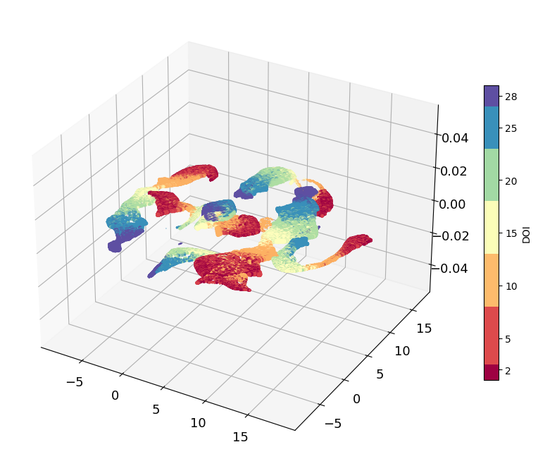
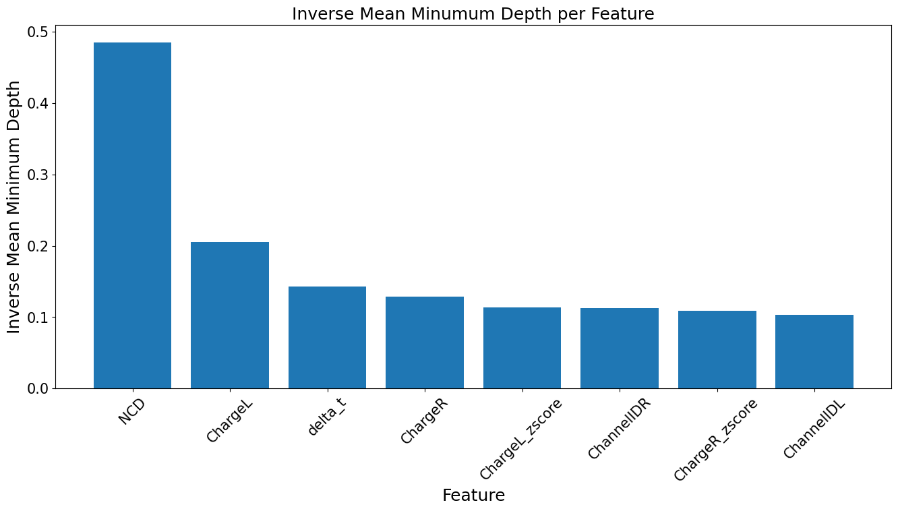
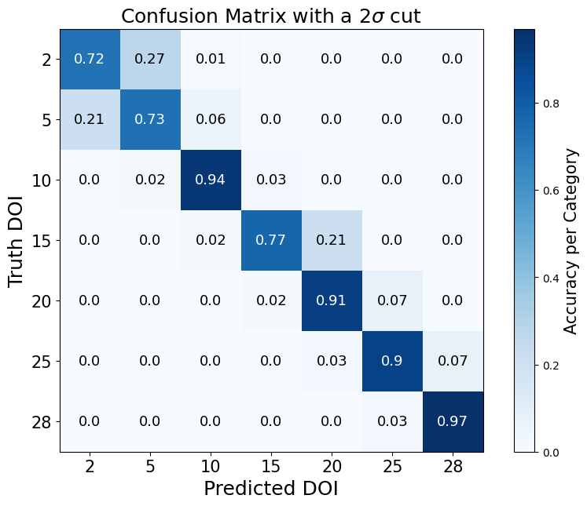
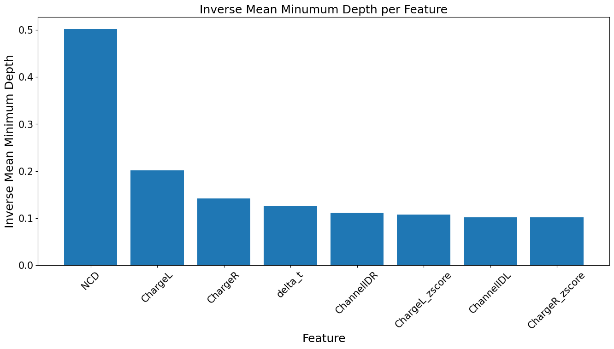
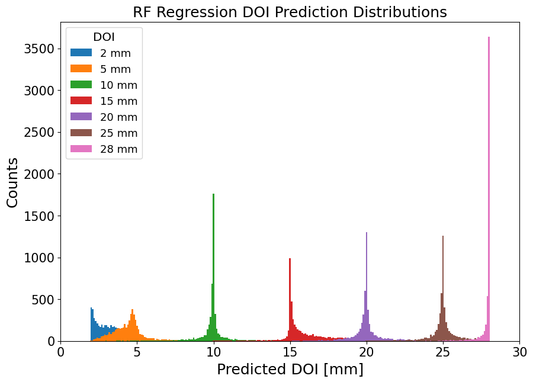

# Machine Learning to identify depth-of-interaction
Depth-of-interaction (DOI) is the depth at which a gamma-ray deposits its energy in a scintilator. DOI can significantly improve PET imaging by correcting parallax
error, the mispositioning of tomographic lines that connect two back-to-back gammas from an annihilation event. Without DOI information, we may assume that each gamma 
interacted at the center of each of the crystals in which they deposited their energy. Hence, when we draw the LOR between the two gammas, we connect the centers of the crystals.
However, oftentimes, the gammas will interact at different depths. For instance, one of the photons may deposit its energy at the front of a crystal while the other deposits 
its energy closer to the back of another crystal. In this case, naively drawing the tomographic line to connect the centers of the crystals would incorrectly localize where the annihilation event 
occurred. The importance of high-resolution image reconstruction calls for effective and efficient methods of determining DOI! Specialized PET scanners that utilize dual-ended readout, a PET scanner with SiPMs coupled on both sides of its scintillator arrays, can yield experimental observables that can allow us to identify DOI. Analysis of experimental data from dual-ended PET illustrates that
certain experimental quantites change as a function of depth allowing us to sometimes distinguish between different DOIs and correct parallax error. Results from the analysis have already shown that DOI resolution, a measure of how well our detectors and corresponding analysis can identify DOI, is a function of crystal surface roguhness (more on this later)! In order to optimize the ability and rapidity of 
identifying DOI, we employ machine learning.

This readme document will:
1. Walk through the basic statistical analysis we can conduct on experimental observables to distinguish DOIs and the general results as well as how to reproduce these results using the python scripts in the [Analysis](/Analysis/) directory. 
2. Illustrate different pre-processing, data transformations, and more that we conduct on our datasets before training an algorithim to identify DOI with the [Processing](/Processing/) directory.
3. Show how we can begin training algorithims on processed datasets, assess the performance of an algorithim, the importance of various features, and more. Here we will use the [Machine-learning](/Machine-Learning/) and [Assessment](/Assessment/) directories. 

All of these directories utilize functions from a suite of header files. For information on these header files, check out the [Headers](/Headers/) directory above.

Lets go through the pipeline of the notebook:

The python scripts in the DOI-MachineLearning have some differences from this notebook. However, the python scripts are all adapted directly from this notebook and achieve the same results.

For instance, the python scripts have additional functions to help streamline the pipeline when running from bash... To see a run down of the bash pipeline see the section Pipeline Appendix in the report.


```python
import tensorflow as tf
from tensorflow.python.ops import resources
import tensorflow_decision_forests as tfdf
import pandas as pd
import numpy as np
import matplotlib.pyplot as plt
from scipy.optimize import curve_fit
from sklearn.datasets import load_digits
from sklearn.model_selection import train_test_split
from sklearn.preprocessing import StandardScaler
import seaborn as sns
import umap.umap_ as umap
from tqdm import tqdm
import matplotlib.patches as mpatches
```

## Technical functions specific to our detector setup
- converts the readout electronic's pixel IDs to more intuitive, chonrological IDs


```python
# the data of interest was collected in these detector channels
DOIchannels = [72, 73, 80, 81, 88, 89, 96, 97]

roughChannels = np.array([[ 78,  73],
                 [ 79,  72],
                 [ 86,  81],
                 [ 87,  80],
                 [ 94,  89],
                 [ 95,  88],
                 [102,  97],
                 [103,  96]])

#converts PETSys ID to geometric ID ; the d
def toGeo(x):
    y = 8*indices.get(x)[0] + indices.get(x)[1]
    return y

indices = {
      0 : (4,7-7),
      1 : (4,7-6),
      2 : (7,7-5),
      3 : (5,7-7),
      4 : (5,7-4),
      5 : (5,7-5),
      6 : (4,7-4),
      7 : (7,7-7),
      8 : (6,7-6),
      9 : (7,7-4),
      10 : (5,7-6),
      11 : (6,7-4),
      12 : (4,7-5),
      13 : (6,7-5),
      14 : (6,7-7),
      15 : (7,7-6),
      16 : (3,7-7),
      17 : (3,7-6),
      18 : (2,7-7),
      19 : (2,7-6),
      20 : (0,7-7),
      21 : (1,7-7),
      22 : (0,7-6),
      23 : (1,7-6),
      24 : (3,7-5),
      25 : (1,7-5),
      26 : (2,7-5),
      27 : (4,7-3),
      28 : (0,7-5),
      29 : (3,7-4),
      30 : (0,7-4),
      31 : (1,7-4),
      32 : (2,7-4),
      33 : (3,7-3),
      34 : (2,7-3),
      35 : (0,7-3),
      36 : (1,7-3),
      37 : (0,7-2),
      38 : (5,7-3),
      39 : (1,7-2),
      40 : (2,7-2),
      41 : (3,7-2),
      42 : (1,7-1),
      43 : (0,7-1),
      44 : (0,7-0),
      45 : (3,7-1),
      46 : (1,7-0),
      47 : (2,7-1),
      48 : (3,7-0),
      49 : (2,7-0),
      50 : (6,7-2),
      51 : (6,7-1),
      52 : (7,7-1),
      53 : (4,7-1),
      54 : (5,7-1),
      55 : (6,7-0),
      56 : (7,7-0),
      57 : (7,7-2),
      58 : (7,7-3),
      59 : (4,7-2),
      60 : (5,7-0),
      61 : (5,7-2),
      62 : (6,7-3),
      63 : (4,7-0),
      64:(3+8,7),
      65:(3+8,6),
      66:(2+8,4),
      67:(2+8,6),
      68:(3+8,4),
      69:(1+8,7),
      70:(1+8,5),
      71:(0+8,7),
      72:(1+8,6),
      73:(3+8,3),
      74:(2+8,7),
      75:(2+8,3),
      76:(3+8,5),
      77:(0+8,5),
      78:(2+8,5),
      79:(0+8,6),
      80:(4+8,7),
      81:(6+8,7),
      82:(5+8,7),
      83:(7+8,7),
      84:(5+8,6),
      85:(4+8,6),
      86:(6+8,6),
      87:(7+8,6),
      88:(4+8,5),
      89:(6+8,5),
      90:(5+8,5),
      91:(1+8,4),
      92:(7+8,5),
      93:(7+8,4),
      94:(6+8,4),
      95:(4+8,4),
      96:(5+8,4),
      97:(5+8,3),
      98:(6+8,3),
      99:(4+8,3),
      100:(7+8,3),
      101:(7+8,2),
      102:(0+8,4),
      103:(6+8,2),
      104:(7+8,1),
      105:(5+8,2),
      106:(6+8,1),
      107:(4+8,2),
      108:(7+8,0),
      109:(5+8,1),
      110:(6+8,0),
      111:(4+8,1),
      112:(5+8,0),
      113:(4+8,0),
      114:(0+8,2),
      115:(2+8,1),
      116:(0+8,1),
      117:(3+8,1),
      118:(1+8,1),
      119:(1+8,0),
      120:(0+8,0),
      121:(1+8,2),
      122:(1+8,3),
      123:(3+8,2),
      124:(2+8,0),
      125:(2+8,2),
      126:(0+8,3),
      127:(3+8,0)}

geo_channels = []
for i in range(128):
    geo_channels.append([i,toGeo(i)])
geo_channels = np.asarray(geo_channels)
    
def toGeoChannelID(x):
    x = x % 128
    y = 8 * indices.get(x)[0] + indices.get(x)[1]
    return y
```

## Data Read-In Functions


```python
# file = /path/to/datafile
# DOI = truth DOI from experiment 
# toGeo = convert channelIDs into geometric IDs
# train_and_test = (T/F split into training & testing ; training size ; testing size)
def getDOIDataFrame(file,DOI,toGeo = True,train_and_test = (True,0,0)):
    df = pd.read_csv(file, delimiter="\t", usecols=(2,3,4,12,13,14))
    df.columns = ["TimeL", "ChargeL", "ChannelIDL", "TimeR", "ChargeR", "ChannelIDR"]
    df["DOI"] = np.array([DOI]*np.shape(df)[0])

    if toGeo == True:
        df['ChannelIDL'] = df['ChannelIDL'].apply(toGeoChannelID)
        df['ChannelIDR'] = df['ChannelIDR'].apply(toGeoChannelID)
    
    # only select channels coupled to the rough crystals 
    df = df[(df["ChannelIDR"] == DOIchannels[0])
    | (df["ChannelIDR"] == DOIchannels[1])
    | (df["ChannelIDR"] == DOIchannels[2])
    | (df["ChannelIDR"] == DOIchannels[3])
    | (df["ChannelIDR"] == DOIchannels[4])
    | (df["ChannelIDR"] == DOIchannels[5])
    | (df["ChannelIDR"] == DOIchannels[6])
    | (df["ChannelIDR"] == DOIchannels[7])
    ]
    
    # reset index now that we've dropped the uninteresting rows of data
    df.index = np.arange(0,np.shape(df)[0],1)
    
    
    if train_and_test[0] == True:
        dfTraining = df[df.index < train_and_test[1]]
        dfTesting = df[(df.index > train_and_test[1]) & (df.index < train_and_test[2])]
        return dfTraining,dfTesting
    else:
        return df
    

def getChannelPairs(df,threshold):
    channelData = df[['ChannelIDL','ChannelIDR']]
    uniqueChannelPairs,Occurences = np.unique(channelData.to_numpy(),axis = 0,return_counts = True)
    mostActiveChannels = np.where(Occurences >= threshold)[0]
    uniqueChannelPairs = uniqueChannelPairs[mostActiveChannels]
    return uniqueChannelPairs
```

## Math Functions 


```python
def gaussian(x,A,mu,sig):
    return A * np.exp(-((x-mu)/sig)**2)
```

## Pre-processing and analysis tools for DOI Machine Learning Project
- The cells below contains all analysis functions needed to complete pre-processing and analysis of DOI data.
- The results from these analyses codes will be used as our statistics for machine learning


```python
# guessing the standard deviation helps isolate the photopeak before we fit to it
def getEnergySpectrum(df,channelID,side,bins,std_guess = 2,photopeakcut = 1.5,display = False):
    fig,ax = plt.subplots()
       
    if side == 'left':
        df_by_chan = df[df.ChannelIDL == channelID]
        energy = df_by_chan.ChargeL
    
    else:
        df_by_chan = df[df.ChannelIDR == channelID]
        energy = df_by_chan.ChargeR
    
    y,x = np.histogram(energy,bins[0],(bins[1],bins[2]))
    centers = (x[:-1] + x[1:]) / 2
    
    # this helps isolate the photopeak making it easier for the fitter to find it
    fitcut = centers[np.where(y == max(y))[0][0]] - std_guess
    
    energy_temp = energy[energy >= fitcut] 
    
    # redefine as we will fit to this cut data
    y,x = np.histogram(energy_temp,bins[0],(bins[1],bins[2]))
    centers = (x[:-1] + x[1:]) / 2
    

    guess = [max(y),centers[np.where(y == max(y))[0][0]],np.std(energy_temp)]
        
    try:
        p,c = curve_fit(gaussian,centers,y,p0=guess)
        xspace = np.linspace(p[1]-2.5*p[2],p[1]+2.5*p[2],500)
        ax.plot(xspace,gaussian(xspace,*p),color = 'red')
        ax.hist(energy,bins = np.linspace(bins[1],bins[2],bins[0]),color = 'C0')
        photopeak_counts = energy[(energy >= p[1] - photopeakcut*p[2]) & (energy <= p[1] + photopeakcut*p[2])]
    
    except:
        p = [-1,-1,-1]
        photopeak_counts = np.array([])
        print('Fit Failed')
        
    if display == False:
        plt.close()
        
    return p,photopeak_counts


# def plotEnergySpectrum()

# normalized count differences is a common metric used for DOI identification
def getNCD(left_Signal,right_signal):
    NCD = (left_Signal - right_signal)/((left_Signal + right_signal))
    return NCD


```

## Umap projection function
- must include DOI at the end of labels list


```python
# get umap projection of the data

# df = (dataframe)
# labels = (names of columns we want to use)
# transform_to_zscore = (transforming to z-score can help the clustering algorithim)
def umapProjection(df,labels,transform_to_zscore = False):
    classes = ["2 mm","5 mm","10 mm","15 mm","20 mm","25 mm","28 mm"]
    colors = ['C0','C1','C2','C3','C4','C5','C6']
    # start umap instance and compute the dimensionality reduction
    reducer = umap.UMAP()
    umapLabels = labels
    umapData = df[umapLabels].values

    # sometimes helps with the clustering algorithim
    if transform_to_zscore == True:
        umapData = StandardScaler().fit_transform(umapData)

    umapData = reducer.fit_transform(umapData)
    
    # plot the projection
    fig,ax = plt.subplots(figsize = (10,7))
    scatter = ax.scatter(
        umapData[:, 0],
        umapData[:, 1],c = [sns.color_palette()[x] for x in df.DOI.map({2:0, 5:1, 10:2, 15:3 , 20:4 , 25:5, 28:6})])

    recs = []

    for i in range(0,len(colors)):
        recs.append(mpatches.Rectangle((0,0),1,1,fc=colors[i]))
    ax.legend(recs,classes,loc = 'best',fontsize = 13)

    plt.gca().set_aspect('equal', 'datalim')
    plt.title('UMAP projection of DOI', fontsize=24);
    plt.xticks(fontsize = 14)
    plt.yticks(fontsize = 14)
    plt.show()
```

## defining our training and testing datasets


```python
# get our raw training and testing datasets, we'll start small for now
# all channels analysis

dir = 'DOI_Data/'
DOIs = [2,5,10,15,20,25,28]


trainingDataList = []
testingDataList = []

for depth in DOIs:
    training,testing = getDOIDataFrame('DOI_Data/28um_DOI_' + str(depth) + 'mm_coinc.txt',DOI=depth,train_and_test = (True,50000,70000))
    
    # shuffle the dataframe so our depths are random and not in order
    training = training.sample(frac = 1)
    testing = testing.sample(frac = 1)
    
    # only use populated channel pairs, less populated channel pairs are indictaive of connection via scattering.
    trainingPairs =  roughChannels
    testingPairs = trainingPairs #getChannelPairs(testing,350)
    
    for channelpairTrain,channelpairTest in zip(trainingPairs,testingPairs):
        
        training2 = training[(training.ChannelIDL == channelpairTrain[0]) & (training.ChannelIDR == channelpairTrain[1])]
        testing2 = testing[(testing.ChannelIDL == channelpairTest[0]) & (testing.ChannelIDR == channelpairTest[1])]
        
        trainingDataList.append(training2)
        testingDataList.append(testing2)
    
# convert back into dataframes & reset the index
trainingData = pd.concat(trainingDataList,ignore_index=True)
testingData = pd.concat(testingDataList,ignore_index=True)

print(np.shape(trainingData),np.shape(testingData))
```

    (337744, 7) (135032, 7)


### Fit to energy and then impose the photopeak energy cut on our datafranes
- a bit of tedious code because we need to do this for both left & right detectors and both training & testing data


```python
run_energy_cut = True

energy_bins = (100,0,40)
energyCut = 2 # number of sigma away from photopeak mean we want to keep 


# for each channel pair, histogram its energy and fit to it then remove channels that don't fall into the photopeak
if run_energy_cut == True:

    energyCutDict = {'ChannelID':[],'energyCut':[],'DOI':[]}
    for chanL in tqdm(np.unique(trainingData.ChannelIDL)):
        for depth in DOIs:
            tempdf = trainingData[trainingData.DOI == depth]
            p,_ = getEnergySpectrum(tempdf,chanL,'left',bins=energy_bins)
            energyCutDict['ChannelID'] += [chanL]
            energyCutDict['energyCut'] += [[p[1]-energyCut*p[2],p[1]+energyCut*p[2]]]
            energyCutDict['DOI'] += [depth]
            
    for chanR in tqdm(np.unique(trainingData.ChannelIDR)):
        for depth in DOIs:
            tempdf = trainingData[trainingData.DOI == depth]
            p,_ = getEnergySpectrum(tempdf,chanR,'right',bins=energy_bins)
            energyCutDict['ChannelID'] += [chanR]
            energyCutDict['energyCut'] += [[p[1]-energyCut*p[2],p[1]+energyCut*p[2]]]
            energyCutDict['DOI'] += [depth]
        
    energyCutDf = pd.DataFrame(energyCutDict)

    trainingArray = trainingData.to_numpy()
    trainingDictEnergyCut = {"TimeL":[], "ChargeL":[], "ChannelIDL":[], "TimeR":[], "ChargeR":[], "ChannelIDR":[],'DOI':[]}
    
    for rownum in tqdm(range(len(trainingArray))):
        row = trainingArray[rownum]
        
        # get the energy cut for each channel at the given DOI 
        ch1_cut = energyCutDf[(energyCutDf.ChannelID == row[2]) & (energyCutDf.DOI == row[6])].energyCut.iloc[0]
        ch1_lower_limit,ch1_upper_limit = ch1_cut[0],ch1_cut[1]                        
        ch2_cut = energyCutDf[(energyCutDf.ChannelID == row[5]) & (energyCutDf.DOI == row[6])].energyCut.iloc[0]
        ch2_lower_limit,ch2_upper_limit = ch2_cut[0],ch2_cut[1]
        
        energy1,energy2 = row[1],row[4]
        
        
        if energy1>=ch1_lower_limit and energy1 <=ch1_upper_limit and energy2>=ch2_lower_limit and energy2 <=ch2_upper_limit:
            trainingDictEnergyCut["TimeL"] += [row[0]]
            trainingDictEnergyCut["ChargeL"] += [row[1]]
            trainingDictEnergyCut["ChannelIDL"] += [row[2]]
            trainingDictEnergyCut["TimeR"] += [row[3]]
            trainingDictEnergyCut["ChargeR"] += [row[4]]
            trainingDictEnergyCut["ChannelIDR"] += [row[5]]
        
            trainingDictEnergyCut["DOI"] += [row[6]]
        
    trainingData = pd.DataFrame(trainingDictEnergyCut) # redefine training data with energy cut


# ###############################################################
# ###############################################################
# ########################### Testing Data ######################
# ###############################################################
# ###############################################################


    energyCutDict = {'ChannelID':[],'energyCut':[],'DOI':[]}
    for chanL in tqdm(np.unique(testingData.ChannelIDL)):
        for depth in DOIs:
            tempdf = testingData[testingData.DOI == depth]
            p,_ = getEnergySpectrum(tempdf,chanL,'left',bins=energy_bins)
            energyCutDict['ChannelID'] += [chanL]
            energyCutDict['energyCut'] += [[p[1]-energyCut*p[2],p[1]+energyCut*p[2]]]
            energyCutDict['DOI'] += [depth]
            
    for chanR in tqdm(np.unique(testingData.ChannelIDR)):
        for depth in DOIs:
            tempdf = testingData[testingData.DOI == depth]
            p,_ = getEnergySpectrum(tempdf,chanR,'right',bins=energy_bins)
            energyCutDict['ChannelID'] += [chanR]
            energyCutDict['energyCut'] += [[p[1]-energyCut*p[2],p[1]+energyCut*p[2]]]
            energyCutDict['DOI'] += [depth]
        
    energyCutDf = pd.DataFrame(energyCutDict)

    testingArray = testingData.to_numpy()
    testingDictEnergyCut = {"TimeL":[], "ChargeL":[], "ChannelIDL":[], "TimeR":[], "ChargeR":[], "ChannelIDR":[],'DOI':[]}
    
    for rownum in tqdm(range(len(testingArray))):
        row = testingArray[rownum]
        
        ch1_cut = energyCutDf[(energyCutDf.ChannelID == row[2]) & (energyCutDf.DOI == row[6])].energyCut.iloc[0]
        ch1_lower_limit,ch1_upper_limit = ch1_cut[0],ch1_cut[1]                        
        ch2_cut = energyCutDf[(energyCutDf.ChannelID == row[5]) & (energyCutDf.DOI == row[6])].energyCut.iloc[0]
        ch2_lower_limit,ch2_upper_limit = ch2_cut[0],ch2_cut[1]
        
        energy1,energy2 = row[1],row[4]
        
        if energy1>=ch1_lower_limit and energy1 <=ch1_upper_limit and energy2>=ch2_lower_limit and energy2 <=ch2_upper_limit:
            testingDictEnergyCut["TimeL"] += [row[0]]
            testingDictEnergyCut["ChargeL"] += [row[1]]
            testingDictEnergyCut["ChannelIDL"] += [row[2]]
            
            testingDictEnergyCut["TimeR"] += [row[3]]
            testingDictEnergyCut["ChargeR"] += [row[4]]
            testingDictEnergyCut["ChannelIDR"] += [row[5]]
        
            testingDictEnergyCut["DOI"] += [row[6]]
        
    testingData = pd.DataFrame(testingDictEnergyCut)

print(np.shape(trainingData),np.shape(testingData))
```

    100%|█████████████████████████████████████████████| 8/8 [00:02<00:00,  3.96it/s]
    100%|█████████████████████████████████████████████| 8/8 [00:01<00:00,  4.08it/s]
    100%|█████████████████████████████████| 337744/337744 [02:10<00:00, 2590.79it/s]
    100%|█████████████████████████████████████████████| 8/8 [00:01<00:00,  4.49it/s]
    100%|█████████████████████████████████████████████| 8/8 [00:01<00:00,  4.40it/s]
    100%|█████████████████████████████████| 135032/135032 [00:52<00:00, 2581.92it/s]


    (90506, 7) (35815, 7)


```python
trainingData['NCD'] = ((trainingData.ChargeL - trainingData.ChargeR)/(trainingData.ChargeR + trainingData.ChargeL))
trainingData['delta_t'] = (trainingData.TimeL - trainingData.TimeR)
trainingData['delta_t'] = trainingData['delta_t'] - np.mean(trainingData['delta_t'])
testingData['NCD'] = ((testingData.ChargeL - testingData.ChargeR)/(testingData.ChargeR + testingData.ChargeL))
testingData['delta_t'] = (testingData.TimeL - testingData.TimeR)
testingData['delta_t'] = testingData['delta_t'] - np.mean(testingData['delta_t'])
```


```python
x = ['NCD','ChargeR','ChargeL',"ChannelIDL","ChannelIDR"]
y = ['DOI']

xTrain = trainingData[x]
yTrain = trainingData[y]
xTest = testingData[x]
yTest = testingData[y]

staticReduction = umap.UMAP(output_metric = "chebyshev",n_components=3,random_state=42,verbose=True).fit(xTrain)


# plot the projection to see what its doing
fig = plt.figure(figsize = (9,9))
ax = fig.add_subplot(projection='3d')

n1 = staticReduction.embedding_[:,0]
n2 = staticReduction.embedding_[:,1]
n3 = staticReduction.embedding_[:,2]
# n4 = staticReduction.embedding_[:,3]
DOIdensity = trainingData.DOI.to_numpy()

scatter = plt.scatter(n1,n2,n3,c=DOIdensity,cmap='Spectral')

bounds = [2,5,10,15,20,25,28,30] #DOIs
fakebounds = [2-1,5-2.5,10-2,15-2,20-2,25-2,28-1,30-1]

cbar = plt.colorbar(scatter,spacing='proportional', ticks=bounds, boundaries=np.array(fakebounds), format='%1i',label = 'DOI',fraction=0.03)
ax.tick_params("z",labelsize = 13)
ax.tick_params("y",labelsize = 13)
ax.tick_params("x",labelsize = 13)


testEmbeddings = staticReduction.transform(xTest)
```

    UMAP(n_components=3, output_metric='chebyshev', random_state=42, verbose=True)
    Sun Nov 26 11:59:18 2023 Construct fuzzy simplicial set
    Sun Nov 26 11:59:18 2023 Finding Nearest Neighbors
    Sun Nov 26 11:59:18 2023 Building RP forest with 20 trees
    Sun Nov 26 11:59:19 2023 NN descent for 16 iterations
         1  /  16
         2  /  16
        Stopping threshold met -- exiting after 2 iterations
    Sun Nov 26 12:03:49 2023 Finished Nearest Neighbor Search
    Sun Nov 26 12:03:50 2023 Construct embedding


    Epochs completed: 100%| ████████████████████████████████████████ 200/200 [00:46]
    /Users/feef/Library/Python/3.9/lib/python/site-packages/matplotlib/collections.py:963: RuntimeWarning: invalid value encountered in sqrt
      scale = np.sqrt(self._sizes) * dpi / 72.0 * self._factor


    Sun Nov 26 12:04:42 2023 Finished embedding
    Sun Nov 26 12:04:43 2023 Worst tree score: 0.99133759
    Sun Nov 26 12:04:43 2023 Mean tree score: 0.99204031
    Sun Nov 26 12:04:43 2023 Best tree score: 0.99265242
    Sun Nov 26 12:04:44 2023 Forward diversification reduced edges from 1357590 to 368935
    Sun Nov 26 12:04:46 2023 Reverse diversification reduced edges from 368935 to 368935
    Sun Nov 26 12:04:46 2023 Degree pruning reduced edges from 317868 to 317868
    Sun Nov 26 12:04:46 2023 Resorting data and graph based on tree order
    Sun Nov 26 12:04:46 2023 Building and compiling search function


    Epochs completed: 100%| ██████████████████████████████████████████ 30/30 [00:02]
    /Users/feef/Library/Python/3.9/lib/python/site-packages/matplotlib/collections.py:963: RuntimeWarning: invalid value encountered in sqrt
      scale = np.sqrt(self._sizes) * dpi / 72.0 * self._factor


    

    


```python
trainingData['n1'] = n1
trainingData['n2'] = n2
trainingData['n3'] = n3
testingData['n1'] = testEmbeddings[:,0]
testingData['n2'] = testEmbeddings[:,1]
testingData['n3'] = testEmbeddings[:,2]
```

### this is a nice processing trick. Transform charge to z-score but do it per channel's charges


```python
import scipy.stats as stats

def zscore_by_channel(df,col_name):
    zscoredData = []
    for chans in roughChannels:
        tempdf = df[(df.ChannelIDL == chans[0]) & (df.ChannelIDR == chans[1])]
        zscoredData.extend(stats.zscore(tempdf[col_name]))
    return zscoredData

rightNorms = []
leftNorms = []
for p in trainingPairs:
    tempdf = trainingData[(trainingData.ChannelIDL == p[0]) & (trainingData.ChannelIDR == p[1])]
    rightNorms.extend(stats.zscore(tempdf['ChargeR']))
    leftNorms.extend(stats.zscore(tempdf['ChargeL']))
    
trainingData['ChargeL_zscore'] = np.array(leftNorms)
trainingData['ChargeR_zscore'] = np.array(rightNorms)

rightNorms = []
leftNorms = []
for p in trainingPairs:
    tempdf = testingData[(testingData.ChannelIDL == p[0]) & (testingData.ChannelIDR == p[1])]
    rightNorms.extend(stats.zscore(tempdf['ChargeR']))
    leftNorms.extend(stats.zscore(tempdf['ChargeL']))
    
testingData['ChargeL_zscore'] = np.array(leftNorms)
testingData['ChargeR_zscore'] = np.array(rightNorms)
```


```python
# shuffle our datasets

trainingData = trainingData.sample(n=np.shape(trainingData)[0])
testingData = testingData.sample(n=np.shape(testingData)[0])
```


```python
features = ['ChannelIDL','ChannelIDR','NCD','delta_t','ChargeR','ChargeL',"ChargeR_zscore","ChargeL_zscore",'DOI']

kerasTrainingFrame = tfdf.keras.pd_dataframe_to_tf_dataset(trainingData[features], label="DOI")
kerasPredictionFrame = tfdf.keras.pd_dataframe_to_tf_dataset(testingData[features], label="DOI")
```


```python
model = tfdf.keras.RandomForestModel(verbose=2,max_depth = 20)
model.fit(kerasTrainingFrame,label='DOI')
```

    Use 12 thread(s) for training
    Use /var/folders/0q/5c4bcz6n2jlc82f86_hqdm1m0000gn/T/tmpg8cr3guv as temporary training directory
    Warning: Model constructor argument label=DOI not supported. See https://www.tensorflow.org/decision_forests/migration for an explanation about the specificities of TF-DF.


    WARNING:absl:Model constructor argument label=DOI not supported. See https://www.tensorflow.org/decision_forests/migration for an explanation about the specificities of TF-DF.


    Reading training dataset...
    Training tensor examples:
    Features: {'ChannelIDL': <tf.Tensor 'data:0' shape=(None,) dtype=float64>, 'ChannelIDR': <tf.Tensor 'data_1:0' shape=(None,) dtype=float64>, 'NCD': <tf.Tensor 'data_2:0' shape=(None,) dtype=float64>, 'delta_t': <tf.Tensor 'data_3:0' shape=(None,) dtype=float64>, 'ChargeR': <tf.Tensor 'data_4:0' shape=(None,) dtype=float64>, 'ChargeL': <tf.Tensor 'data_5:0' shape=(None,) dtype=float64>, 'ChargeR_zscore': <tf.Tensor 'data_6:0' shape=(None,) dtype=float64>, 'ChargeL_zscore': <tf.Tensor 'data_7:0' shape=(None,) dtype=float64>}
    Label: Tensor("data_8:0", shape=(None,), dtype=float64)
    Weights: None
    Normalized tensor features:
     {'ChannelIDL': SemanticTensor(semantic=<Semantic.NUMERICAL: 1>, tensor=<tf.Tensor 'Cast:0' shape=(None,) dtype=float32>), 'ChannelIDR': SemanticTensor(semantic=<Semantic.NUMERICAL: 1>, tensor=<tf.Tensor 'Cast_1:0' shape=(None,) dtype=float32>), 'NCD': SemanticTensor(semantic=<Semantic.NUMERICAL: 1>, tensor=<tf.Tensor 'Cast_2:0' shape=(None,) dtype=float32>), 'delta_t': SemanticTensor(semantic=<Semantic.NUMERICAL: 1>, tensor=<tf.Tensor 'Cast_3:0' shape=(None,) dtype=float32>), 'ChargeR': SemanticTensor(semantic=<Semantic.NUMERICAL: 1>, tensor=<tf.Tensor 'Cast_4:0' shape=(None,) dtype=float32>), 'ChargeL': SemanticTensor(semantic=<Semantic.NUMERICAL: 1>, tensor=<tf.Tensor 'Cast_5:0' shape=(None,) dtype=float32>), 'ChargeR_zscore': SemanticTensor(semantic=<Semantic.NUMERICAL: 1>, tensor=<tf.Tensor 'Cast_6:0' shape=(None,) dtype=float32>), 'ChargeL_zscore': SemanticTensor(semantic=<Semantic.NUMERICAL: 1>, tensor=<tf.Tensor 'Cast_7:0' shape=(None,) dtype=float32>)}
    Training dataset read in 0:00:02.151823. Found 90506 examples.
    Training model...
    Standard output detected as not visible to the user e.g. running in a notebook. Creating a training log redirection. If training gets stuck, try calling tfdf.keras.set_training_logs_redirection(False).


    [INFO 23-11-26 12:05:30.5676 CST kernel.cc:773] Start Yggdrasil model training
    [INFO 23-11-26 12:05:30.5682 CST kernel.cc:774] Collect training examples
    [INFO 23-11-26 12:05:30.5682 CST kernel.cc:787] Dataspec guide:
    column_guides {
      column_name_pattern: "^__LABEL$"
      type: CATEGORICAL
      categorial {
        min_vocab_frequency: 0
        max_vocab_count: -1
      }
    }
    default_column_guide {
      categorial {
        max_vocab_count: 2000
      }
      discretized_numerical {
        maximum_num_bins: 255
      }
    }
    ignore_columns_without_guides: false
    detect_numerical_as_discretized_numerical: false
    
    [INFO 23-11-26 12:05:30.5684 CST kernel.cc:393] Number of batches: 91
    [INFO 23-11-26 12:05:30.5684 CST kernel.cc:394] Number of examples: 90506
    [INFO 23-11-26 12:05:30.5741 CST kernel.cc:794] Training dataset:
    Number of records: 90506
    Number of columns: 9
    
    Number of columns by type:
        NUMERICAL: 8 (88.8889%)
        CATEGORICAL: 1 (11.1111%)
    
    Columns:
    
    NUMERICAL: 8 (88.8889%)
        0: "ChannelIDL" NUMERICAL mean:90.5126 min:78 max:103 sd:8.99243
        1: "ChannelIDR" NUMERICAL mean:84.4071 min:72 max:97 sd:8.98722
        2: "ChargeL" NUMERICAL mean:23.712 min:12.8117 max:34.7163 sd:4.44568
        3: "ChargeL_zscore" NUMERICAL mean:4.41769e-11 min:-1.97234 max:2.14222 sd:1
        4: "ChargeR" NUMERICAL mean:20.5026 min:11.3305 max:29.3877 sd:3.68849
        5: "ChargeR_zscore" NUMERICAL mean:1.07346e-10 min:-2.24938 max:2.17171 sd:1
        6: "NCD" NUMERICAL mean:0.0698258 min:-0.288731 max:0.409941 sd:0.16987
        8: "delta_t" NUMERICAL mean:-4.95133e-06 min:-6368.51 max:6316.49 sd:525.278
    
    CATEGORICAL: 1 (11.1111%)
        7: "__LABEL" CATEGORICAL integerized vocab-size:30 no-ood-item
    
    Terminology:
        nas: Number of non-available (i.e. missing) values.
        ood: Out of dictionary.
        manually-defined: Attribute which type is manually defined by the user i.e. the type was not automatically inferred.
        tokenized: The attribute value is obtained through tokenization.
        has-dict: The attribute is attached to a string dictionary e.g. a categorical attribute stored as a string.
        vocab-size: Number of unique values.
    
    [INFO 23-11-26 12:05:30.5741 CST kernel.cc:810] Configure learner
    [INFO 23-11-26 12:05:30.5742 CST kernel.cc:824] Training config:
    learner: "RANDOM_FOREST"
    features: "^ChannelIDL$"
    features: "^ChannelIDR$"
    features: "^ChargeL$"
    features: "^ChargeL_zscore$"
    features: "^ChargeR$"
    features: "^ChargeR_zscore$"
    features: "^NCD$"
    features: "^delta_t$"
    label: "^__LABEL$"
    task: CLASSIFICATION
    random_seed: 123456
    metadata {
      framework: "TF Keras"
    }
    pure_serving_model: false
    [yggdrasil_decision_forests.model.random_forest.proto.random_forest_config] {
      num_trees: 300
      decision_tree {
        max_depth: 20
        min_examples: 5
        in_split_min_examples_check: true
        keep_non_leaf_label_distribution: true
        num_candidate_attributes: 0
        missing_value_policy: GLOBAL_IMPUTATION
        allow_na_conditions: false
        categorical_set_greedy_forward {
          sampling: 0.1
          max_num_items: -1
          min_item_frequency: 1
        }
        growing_strategy_local {
        }
        categorical {
          cart {
          }
        }
        axis_aligned_split {
        }
        internal {
          sorting_strategy: PRESORTED
        }
        uplift {
          min_examples_in_treatment: 5
          split_score: KULLBACK_LEIBLER
        }
      }
      winner_take_all_inference: true
      compute_oob_performances: true
      compute_oob_variable_importances: false
      num_oob_variable_importances_permutations: 1
      bootstrap_training_dataset: true
      bootstrap_size_ratio: 1
      adapt_bootstrap_size_ratio_for_maximum_training_duration: false
      sampling_with_replacement: true
    }
    
    [INFO 23-11-26 12:05:30.5743 CST kernel.cc:827] Deployment config:
    cache_path: "/var/folders/0q/5c4bcz6n2jlc82f86_hqdm1m0000gn/T/tmpg8cr3guv/working_cache"
    num_threads: 12
    try_resume_training: true
    
    [INFO 23-11-26 12:05:30.5745 CST kernel.cc:889] Train model
    [INFO 23-11-26 12:05:30.5745 CST random_forest.cc:416] Training random forest on 90506 example(s) and 8 feature(s).
    [INFO 23-11-26 12:05:30.9024 CST random_forest.cc:802] Training of tree  1/300 (tree index:11) done accuracy:0.825984 logloss:6.27217
    [INFO 23-11-26 12:05:30.9958 CST random_forest.cc:802] Training of tree  11/300 (tree index:3) done accuracy:0.856525 logloss:2.04722
    [INFO 23-11-26 12:05:31.3293 CST random_forest.cc:802] Training of tree  21/300 (tree index:17) done accuracy:0.870001 logloss:1.11457
    [INFO 23-11-26 12:05:31.6442 CST random_forest.cc:802] Training of tree  31/300 (tree index:30) done accuracy:0.874517 logloss:0.813728
    [INFO 23-11-26 12:05:31.9506 CST random_forest.cc:802] Training of tree  41/300 (tree index:40) done accuracy:0.876384 logloss:0.67612
    [INFO 23-11-26 12:05:32.2672 CST random_forest.cc:802] Training of tree  51/300 (tree index:50) done accuracy:0.878384 logloss:0.594625
    [INFO 23-11-26 12:05:32.5400 CST random_forest.cc:802] Training of tree  61/300 (tree index:60) done accuracy:0.878748 logloss:0.542787
    [INFO 23-11-26 12:05:32.7424 CST random_forest.cc:802] Training of tree  71/300 (tree index:70) done accuracy:0.879489 logloss:0.501422
    [INFO 23-11-26 12:05:33.0430 CST random_forest.cc:802] Training of tree  81/300 (tree index:81) done accuracy:0.879942 logloss:0.476745
    [INFO 23-11-26 12:05:33.3440 CST random_forest.cc:802] Training of tree  91/300 (tree index:90) done accuracy:0.880163 logloss:0.457979
    [INFO 23-11-26 12:05:33.6441 CST random_forest.cc:802] Training of tree  101/300 (tree index:100) done accuracy:0.880627 logloss:0.441059
    [INFO 23-11-26 12:05:33.9381 CST random_forest.cc:802] Training of tree  111/300 (tree index:111) done accuracy:0.880373 logloss:0.428885
    [INFO 23-11-26 12:05:34.2184 CST random_forest.cc:802] Training of tree  121/300 (tree index:120) done accuracy:0.880395 logloss:0.420926
    [INFO 23-11-26 12:05:34.4689 CST random_forest.cc:802] Training of tree  131/300 (tree index:130) done accuracy:0.880527 logloss:0.411838
    [INFO 23-11-26 12:05:34.7589 CST random_forest.cc:802] Training of tree  141/300 (tree index:141) done accuracy:0.880682 logloss:0.403044
    [INFO 23-11-26 12:05:35.0482 CST random_forest.cc:802] Training of tree  151/300 (tree index:151) done accuracy:0.88077 logloss:0.396619
    [INFO 23-11-26 12:05:35.3005 CST random_forest.cc:802] Training of tree  161/300 (tree index:160) done accuracy:0.88108 logloss:0.391815
    [INFO 23-11-26 12:05:35.6124 CST random_forest.cc:802] Training of tree  171/300 (tree index:170) done accuracy:0.881024 logloss:0.385842
    [INFO 23-11-26 12:05:35.9008 CST random_forest.cc:802] Training of tree  181/300 (tree index:180) done accuracy:0.881444 logloss:0.379439
    [INFO 23-11-26 12:05:36.1784 CST random_forest.cc:802] Training of tree  191/300 (tree index:191) done accuracy:0.881544 logloss:0.374386
    [INFO 23-11-26 12:05:36.4429 CST random_forest.cc:802] Training of tree  201/300 (tree index:201) done accuracy:0.881599 logloss:0.370882
    [INFO 23-11-26 12:05:36.7457 CST random_forest.cc:802] Training of tree  211/300 (tree index:209) done accuracy:0.88161 logloss:0.366585
    [INFO 23-11-26 12:05:37.0167 CST random_forest.cc:802] Training of tree  221/300 (tree index:220) done accuracy:0.881864 logloss:0.365098
    [INFO 23-11-26 12:05:37.3355 CST random_forest.cc:802] Training of tree  231/300 (tree index:232) done accuracy:0.88161 logloss:0.362526
    [INFO 23-11-26 12:05:37.6071 CST random_forest.cc:802] Training of tree  241/300 (tree index:240) done accuracy:0.881687 logloss:0.360689
    [INFO 23-11-26 12:05:37.8829 CST random_forest.cc:802] Training of tree  251/300 (tree index:250) done accuracy:0.88171 logloss:0.359205
    [INFO 23-11-26 12:05:38.1414 CST random_forest.cc:802] Training of tree  261/300 (tree index:260) done accuracy:0.881566 logloss:0.355134
    [INFO 23-11-26 12:05:38.4162 CST random_forest.cc:802] Training of tree  271/300 (tree index:270) done accuracy:0.881433 logloss:0.35162
    [INFO 23-11-26 12:05:38.6932 CST random_forest.cc:802] Training of tree  281/300 (tree index:276) done accuracy:0.881831 logloss:0.349782
    [INFO 23-11-26 12:05:39.0058 CST random_forest.cc:802] Training of tree  291/300 (tree index:290) done accuracy:0.881776 logloss:0.349094
    [INFO 23-11-26 12:05:39.2161 CST random_forest.cc:802] Training of tree  300/300 (tree index:299) done accuracy:0.881566 logloss:0.348077
    [INFO 23-11-26 12:05:39.2162 CST random_forest.cc:882] Final OOB metrics: accuracy:0.881566 logloss:0.348077
    [INFO 23-11-26 12:05:39.4227 CST kernel.cc:926] Export model in log directory: /var/folders/0q/5c4bcz6n2jlc82f86_hqdm1m0000gn/T/tmpg8cr3guv with prefix 04faf1b27ada4915
    [INFO 23-11-26 12:05:40.9059 CST kernel.cc:944] Save model in resources
    [INFO 23-11-26 12:05:40.9080 CST abstract_model.cc:849] Model self evaluation:
    Number of predictions (without weights): 90506
    Number of predictions (with weights): 90506
    Task: CLASSIFICATION
    Label: __LABEL
    
    Accuracy: 0.881566  CI95[W][0.879785 0.883329]
    LogLoss: : 0.348077
    ErrorRate: : 0.118434
    
    Default Accuracy: : 0.147847
    Default LogLoss: : 1.94556
    Default ErrorRate: : 0.852153
    
    Confusion Table:
    truth\prediction
        0  1  2     3  4  5     6  7  8  9  10     11  12  13  14  15     16  17  18  19  20     21  22  23  24  25     26  27  28     29
     0  0  0  0     0  0  0     0  0  0  0   0      0   0   0   0   0      0   0   0   0   0      0   0   0   0   0      0   0   0      0
     1  0  0  0     0  0  0     0  0  0  0   0      0   0   0   0   0      0   0   0   0   0      0   0   0   0   0      0   0   0      0
     2  0  0  0     0  0  0     0  0  0  0   0      0   0   0   0   0      0   0   0   0   0      0   0   0   0   0      0   0   0      0
     3  0  0  0  9495  0  0  2814  0  0  0   0    118   0   0   0   0      0   0   0   0   0      0   0   0   0   0      0   0   0      0
     4  0  0  0     0  0  0     0  0  0  0   0      0   0   0   0   0      0   0   0   0   0      0   0   0   0   0      0   0   0      0
     5  0  0  0     0  0  0     0  0  0  0   0      0   0   0   0   0      0   0   0   0   0      0   0   0   0   0      0   0   0      0
     6  0  0  0  2593  0  0  9928  0  0  0   0    488   0   0   0   0      0   0   0   0   0      0   0   0   0   0      0   0   0      0
     7  0  0  0     0  0  0     0  0  0  0   0      0   0   0   0   0      0   0   0   0   0      0   0   0   0   0      0   0   0      0
     8  0  0  0     0  0  0     0  0  0  0   0      0   0   0   0   0      0   0   0   0   0      0   0   0   0   0      0   0   0      0
     9  0  0  0     0  0  0     0  0  0  0   0      0   0   0   0   0      0   0   0   0   0      0   0   0   0   0      0   0   0      0
    10  0  0  0     0  0  0     0  0  0  0   0      0   0   0   0   0      0   0   0   0   0      0   0   0   0   0      0   0   0      0
    11  0  0  0    56  0  0   526  0  0  0   0  12214   0   0   0   0    268   0   0   0   0      7   0   0   0   0      0   0   0      0
    12  0  0  0     0  0  0     0  0  0  0   0      0   0   0   0   0      0   0   0   0   0      0   0   0   0   0      0   0   0      0
    13  0  0  0     0  0  0     0  0  0  0   0      0   0   0   0   0      0   0   0   0   0      0   0   0   0   0      0   0   0      0
    14  0  0  0     0  0  0     0  0  0  0   0      0   0   0   0   0      0   0   0   0   0      0   0   0   0   0      0   0   0      0
    15  0  0  0     0  0  0     0  0  0  0   0      0   0   0   0   0      0   0   0   0   0      0   0   0   0   0      0   0   0      0
    16  0  0  0     0  0  0     0  0  0  0   0    335   0   0   0   0  11567   0   0   0   0    776   0   0   0   0     12   0   0      0
    17  0  0  0     0  0  0     0  0  0  0   0      0   0   0   0   0      0   0   0   0   0      0   0   0   0   0      0   0   0      0
    18  0  0  0     0  0  0     0  0  0  0   0      0   0   0   0   0      0   0   0   0   0      0   0   0   0   0      0   0   0      0
    19  0  0  0     0  0  0     0  0  0  0   0      0   0   0   0   0      0   0   0   0   0      0   0   0   0   0      0   0   0      0
    20  0  0  0     0  0  0     0  0  0  0   0      0   0   0   0   0      0   0   0   0   0      0   0   0   0   0      0   0   0      0
    21  0  0  0     0  0  0     0  0  0  0   0     12   0   0   0   0    850   0   0   0   0  11938   0   0   0   0    529   0   0      7
    22  0  0  0     0  0  0     0  0  0  0   0      0   0   0   0   0      0   0   0   0   0      0   0   0   0   0      0   0   0      0
    23  0  0  0     0  0  0     0  0  0  0   0      0   0   0   0   0      0   0   0   0   0      0   0   0   0   0      0   0   0      0
    24  0  0  0     0  0  0     0  0  0  0   0      0   0   0   0   0      0   0   0   0   0      0   0   0   0   0      0   0   0      0
    25  0  0  0     0  0  0     0  0  0  0   0      0   0   0   0   0      0   0   0   0   0      0   0   0   0   0      0   0   0      0
    26  0  0  0     0  0  0     0  0  0  0   0      0   0   0   0   0      7   0   0   0   0    392   0   0   0   0  12594   0   0    388
    27  0  0  0     0  0  0     0  0  0  0   0      0   0   0   0   0      0   0   0   0   0      0   0   0   0   0      0   0   0      0
    28  0  0  0     0  0  0     0  0  0  0   0      0   0   0   0   0      0   0   0   0   0      0   0   0   0   0      0   0   0      0
    29  0  0  0     0  0  0     0  0  0  0   0      0   0   0   0   0      2   0   0   0   0     13   0   0   0   0    526   0   0  12051
    Total: 90506
    
    One vs other classes:
    
    [INFO 23-11-26 12:05:41.2714 CST kernel.cc:1243] Loading model from path /var/folders/0q/5c4bcz6n2jlc82f86_hqdm1m0000gn/T/tmpg8cr3guv/model/ with prefix 04faf1b27ada4915
    [INFO 23-11-26 12:05:44.5072 CST decision_forest.cc:660] Model loaded with 300 root(s), 2566256 node(s), and 8 input feature(s).
    [INFO 23-11-26 12:05:44.5073 CST abstract_model.cc:1312] Engine "RandomForestGeneric" built
    [INFO 23-11-26 12:05:44.5073 CST kernel.cc:1075] Use fast generic engine


    Model trained in 0:00:14.224251
    Compiling model...
    WARNING:tensorflow:AutoGraph could not transform <function simple_ml_inference_op_with_handle at 0x2b96de820> and will run it as-is.
    Please report this to the TensorFlow team. When filing the bug, set the verbosity to 10 (on Linux, `export AUTOGRAPH_VERBOSITY=10`) and attach the full output.
    Cause: could not get source code
    To silence this warning, decorate the function with @tf.autograph.experimental.do_not_convert


    WARNING:tensorflow:AutoGraph could not transform <function simple_ml_inference_op_with_handle at 0x2b96de820> and will run it as-is.
    Please report this to the TensorFlow team. When filing the bug, set the verbosity to 10 (on Linux, `export AUTOGRAPH_VERBOSITY=10`) and attach the full output.
    Cause: could not get source code
    To silence this warning, decorate the function with @tf.autograph.experimental.do_not_convert


    WARNING: AutoGraph could not transform <function simple_ml_inference_op_with_handle at 0x2b96de820> and will run it as-is.
    Please report this to the TensorFlow team. When filing the bug, set the verbosity to 10 (on Linux, `export AUTOGRAPH_VERBOSITY=10`) and attach the full output.
    Cause: could not get source code
    To silence this warning, decorate the function with @tf.autograph.experimental.do_not_convert
    Model compiled.


    <keras.src.callbacks.History at 0x30d9591f0>


```python
compilation = model.compile(metrics=["Accuracy"])
evaluation = model.evaluate(kerasPredictionFrame,return_dict=True)
```

    36/36 [==============================] - 3s 78ms/step - loss: 0.0000e+00 - Accuracy: 0.8500


```python
# plot inverse mean minimum 
importances = (model.make_inspector().variable_importances()['INV_MEAN_MIN_DEPTH'])
used_features = []
inv_mean_min_depth = []
for feats in importances:
    used_features.append(feats[0][0])
    inv_mean_min_depth.append(feats[1])
    
mean_min_depth = 1/np.array(inv_mean_min_depth)

fig,ax = plt.subplots(figsize = (16,7))
plt.bar(used_features,inv_mean_min_depth)
plt.title('Inverse Mean Minumum Depth per Feature',fontsize = 18)
plt.ylabel('Inverse Mean Minimum Depth',fontsize = 18)
plt.xlabel('Feature',fontsize = 18)
plt.xticks(fontsize = 15,rotation = 45)
plt.yticks(fontsize = 15)
```


    (array([0. , 0.1, 0.2, 0.3, 0.4, 0.5, 0.6]),
     [Text(0, 0.0, '0.0'),
      Text(0, 0.1, '0.1'),
      Text(0, 0.2, '0.2'),
      Text(0, 0.30000000000000004, '0.3'),
      Text(0, 0.4, '0.4'),
      Text(0, 0.5, '0.5'),
      Text(0, 0.6000000000000001, '0.6')])


    

    


```python
# let's actually test our model
predict = model.predict(kerasPredictionFrame)
predict = np.argmax(predict, axis=1)
predict = predict.reshape(predict.shape[0], 1)

for name, value in evaluation.items():
    print(f"{name}: {value:.4f}")
```

    36/36 [==============================] - 3s 75ms/step
    loss: 0.0000
    Accuracy: 0.8500


### print accuracy per category & plot the confusion matrix


```python
# checking accuracy per category!

from sklearn.preprocessing import normalize
from sklearn.metrics import confusion_matrix

normalize_per_category = True

# define our confusion matrix
matrix = np.transpose(confusion_matrix(predict,testingData.DOI))


if normalize_per_category == True:
    matrix = np.round(normalize(matrix,axis=1,norm='l1'),2)
    lowcolor = 0.7
else:
    lowcolor = 4000

DOI_index = 0
correct = 0
notCorrect = 0
for row in matrix:
    accuracy = row[DOI_index]/np.sum(row)
    correct += row[DOI_index]
    notCorrect += np.sum(row) - row[DOI_index]
    print('Accuracy for ' + str(DOIs[DOI_index]) + ' mm DOI:',np.round(accuracy,3))
    DOI_index += 1
print('Total Accuracy: ',np.round(correct/(correct + notCorrect),3))

# imshow will plot this by index in the list
doiIndices = np.arange(0,7,1)

fig,ax = plt.subplots(figsize = (10,7))
plt.imshow(matrix,cmap='Blues') 
plt.colorbar().set_label(label='Accuracy per Category',size=15)
plt.xticks(doiIndices,DOIs,fontsize = 15)
plt.yticks(doiIndices,DOIs,fontsize = 15)

for i in doiIndices:
    for j in doiIndices:
        if matrix[j,i] < lowcolor:
            plt.text(i,j,matrix[j,i],ha="center", va="center",c='black',fontsize = 13)
        else:
            plt.text(i,j,matrix[j,i],ha="center", va="center",c='w',fontsize = 13)

plt.ylabel('Truth DOI',fontsize = 18)
plt.xlabel('Predicted DOI',fontsize = 18)
plt.title('Confusion Matrix with a 2$\sigma$ cut',fontsize = 18)
```

    Accuracy for 2 mm DOI: 0.72
    Accuracy for 5 mm DOI: 0.73
    Accuracy for 10 mm DOI: 0.949
    Accuracy for 15 mm DOI: 0.77
    Accuracy for 20 mm DOI: 0.91
    Accuracy for 25 mm DOI: 0.9
    Accuracy for 28 mm DOI: 0.97
    Total Accuracy:  0.85


    Text(0.5, 1.0, 'Confusion Matrix with a 2$\\sigma$ cut')


    

    


## Regression Models for predicting continuous variables


```python
features = ["NCD","ChargeR","ChargeL","ChargeR_zscore","ChargeL_zscore","delta_t","ChannelIDL","ChannelIDR",'DOI']
kerasTrainingFrame_Regression = tfdf.keras.pd_dataframe_to_tf_dataset(trainingData[features], label="DOI",task=tfdf.keras.Task.REGRESSION)
kerasTestingFrame_Regression = tfdf.keras.pd_dataframe_to_tf_dataset(testingData[features], label="DOI",task=tfdf.keras.Task.REGRESSION)
```


```python
model_regression = tfdf.keras.RandomForestModel(task = tfdf.keras.Task.REGRESSION,max_depth = 20)
model_regression.fit(kerasTrainingFrame_Regression)
```

    Use /var/folders/0q/5c4bcz6n2jlc82f86_hqdm1m0000gn/T/tmp0f5oa2i2 as temporary training directory
    Reading training dataset...
    Training dataset read in 0:00:00.266419. Found 90506 examples.
    Training model...


    [INFO 23-11-26 12:06:10.5582 CST kernel.cc:1243] Loading model from path /var/folders/0q/5c4bcz6n2jlc82f86_hqdm1m0000gn/T/tmp0f5oa2i2/model/ with prefix 93feff0494784198
    [INFO 23-11-26 12:06:13.5283 CST decision_forest.cc:660] Model loaded with 300 root(s), 2625970 node(s), and 8 input feature(s).
    [INFO 23-11-26 12:06:13.5284 CST abstract_model.cc:1312] Engine "RandomForestOptPred" built
    [INFO 23-11-26 12:06:13.5284 CST kernel.cc:1075] Use fast generic engine


    Model trained in 0:00:10.355123
    Compiling model...
    Model compiled.


    <keras.src.callbacks.History at 0x30da28f10>


```python
model_regression.compile(metrics=["mse"])
evaluation = model_regression.evaluate(kerasTestingFrame_Regression, return_dict=True)

print(evaluation)
print()
print("MSE: {}".format(evaluation['mse']))
print("RMSE: {}".format(np.sqrt(evaluation['mse'])))
```

    36/36 [==============================] - 2s 42ms/step - loss: 0.0000e+00 - mse: 1.9779
    {'loss': 0.0, 'mse': 1.9778531789779663}
    
    MSE: 1.9778531789779663
    RMSE: 1.4063616814240802


```python
# plot inverse mean minimum 
importances = (model_regression.make_inspector().variable_importances()['INV_MEAN_MIN_DEPTH'])
used_features = []
inv_mean_min_depth = []
for feats in importances:
    used_features.append(feats[0][0])
    inv_mean_min_depth.append(feats[1])
    

fig,ax = plt.subplots(figsize = (16,7))
plt.bar(used_features,inv_mean_min_depth)
plt.title('Inverse Mean Minumum Depth per Feature',fontsize = 18)
plt.ylabel('Inverse Mean Minimum Depth',fontsize = 18)
plt.xlabel('Feature',fontsize = 18)
plt.xticks(fontsize = 15,rotation = 45)
plt.yticks(fontsize = 15)
```


    (array([0. , 0.1, 0.2, 0.3, 0.4, 0.5, 0.6]),
     [Text(0, 0.0, '0.0'),
      Text(0, 0.1, '0.1'),
      Text(0, 0.2, '0.2'),
      Text(0, 0.30000000000000004, '0.3'),
      Text(0, 0.4, '0.4'),
      Text(0, 0.5, '0.5'),
      Text(0, 0.6000000000000001, '0.6')])


    

    


```python
prediction = model_regression.predict(kerasTestingFrame_Regression)
```

    36/36 [==============================] - 1s 40ms/step


```python
fig,ax = plt.subplots(figsize = (10,7))
newDOIs = DOIs[-1:]
for i in DOIs:
    whereDOI = np.where(testingData.DOI == i)[0]
    bins = np.linspace(i-10,i+10,200)
    y,x,_ = plt.hist(prediction[whereDOI],bins = bins,label = str(i) + ' mm')
plt.ylabel('Counts',fontsize = 18)
plt.xlabel('Predicted DOI [mm]',fontsize = 18)
plt.xticks(fontsize = 15)
plt.yticks(fontsize = 15)
plt.title('RF Regression DOI Prediction Distributions',fontsize = 18)
leg = plt.legend(title = "DOI",fontsize = 13)
leg.set_title("DOI", prop = {'size':'x-large'})
plt.xlim(0,30)
```


    (0.0, 30.0)


    

    


```python
resultFrame = pd.DataFrame(columns = ["ChannelIDL","ChannelIDR","Truth","Predicted"])
resultFrame["ChannelIDL"] = testingData.ChannelIDL
resultFrame["ChannelIDR"] = testingData.ChannelIDR
resultFrame["Truth"] = testingData.DOI
resultFrame["Predicted"] = prediction
```


```python
N = np.shape(trainingData)[0]

omit_2_28 = True
print_averages = True


if omit_2_28 == True: # necessary due to the asymmetric distributions
    useDOIs = DOIs[1:6]
    
else:
    useDOIs = DOIs
    
resolutionFrame = pd.DataFrame(columns = ["ChannelIDL","ChannelIDR","DOI","FWHM","error","efficiency"])
currentIndex = 0
for channelL,channelR in zip(roughChannels[:,0],roughChannels[:,1]):
    for depth in useDOIs:
        
        # get all instances at specific channel and DOI
        whereDOI = np.where((resultFrame.ChannelIDL == channelL) & (resultFrame.Truth == depth))[0]

        data = resultFrame.Truth.to_numpy()[whereDOI] - resultFrame.Predicted.to_numpy()[whereDOI]
        
        y,x = np.histogram(data,50)
        centers = (x[:-1] + x[1:]) / 2
        try:
            
            # construct a reasonable guess for our fit
            a = np.where(y == max(y))[0][0]
            mu = centers[a]
            A = y[a]
            std = 0.1
            guess = [A,mu,std]
            
            
            # fit to Gaussian to DOI
            p,c = curve_fit(gaussian,centers,y)
            p = abs(p)
                       
            FWHM = p[2]*2.355
            ERR = np.sqrt(c[2,2])*2.355/np.sqrt(N) # standard error calculation
            
            # calculating efficiency
            inside = np.where((centers <= p[1] + 2.5*p[2]) & (centers >= p[1] - 2.5*p[2]))
            outside = np.where((centers >= p[1] + 2.5*p[2]) | (centers <= p[1] - 2.5*p[2]))
            yinside = y[inside]
            youtside = y[outside]
            
            efficiency = 1 - np.sum(youtside)/(np.sum(youtside) + np.sum(yinside))
            
            resolutionFrame.loc[currentIndex] = [channelL,channelR,depth,FWHM,ERR,efficiency]
            
            currentIndex += 1
        except:
            pass

if print_averages == True:
    print()
    if omit_2_28 == True:
        for depth in useDOIs:
            res = np.round(resolutionFrame[resolutionFrame.DOI == depth].FWHM.mean(),3)
            eff = np.round(resolutionFrame[resolutionFrame.DOI == depth].efficiency.mean(),3)
            print("Average Resolution at {} mm DOI: {} mm with {}% effciency".format(depth,res,eff*100))

```

    
    Average Resolution at 5 mm DOI: 1.635 mm with 85.5% effciency
    Average Resolution at 10 mm DOI: 0.455 mm with 73.5% effciency
    Average Resolution at 15 mm DOI: 2.717 mm with 67.4% effciency
    Average Resolution at 20 mm DOI: 0.525 mm with 68.89999999999999% effciency
    Average Resolution at 25 mm DOI: 0.511 mm with 69.19999999999999% effciency


